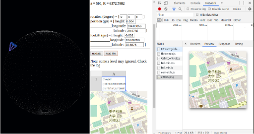

# About

Shader-demo is a Glsl shader testing and visual effects lib.

This is a temp repo for now. The js lib distribution will using Webpack in the future. For now, there is a helping tool, cp-res, in shader-demo/lib directory for copying necessary files. Users need modify the "src" array to indicate their git location, then copy files to their application/oz dir.

The bash script is only can be used in linux.

The [shadertoy](https://en.wikipedia.org/wiki/Shadertoy) and raymatching is some how different from the well known style of 3d rendering, see [2].

This repository is a testing project using three.js for running shaders from shadertoy
in a html file, independent to shadertoy.

Here are some of the results:

- basic raymatching shape

Try the different algorithms in [3].

- platonic solids

Shapes melding, because of power of "mix()".

- volumetric rendering example

- data texture

- geojson model, GPU pick

- dynamic points

- [OSM](https://wiki.openstreetmap.org/wiki/Main_Page) axis convertion

- [OSM 3D Bulidings](https://osmbuildings.org/documentation/viewer/api/) Hacked

Hacking Memo:

1. Tiles and bulidings are scaled differently with respect to latitude;

2. Using web works to handling data tasks asynchronously, scheduled by a manager
class - Grid;

* Grid#update() are peroidically called and visible tiles are collected;

* Data access tasks are queued by Grid#update();

* When tile is case of GeoJSON, tasks will create new Features, which in turn will
load geojson data;

* When geojson data loaded, it post message to another worker, feature/worker.js,
which will convert geojson (mainly polygons) into webgl compitable data, in method
feature/worker.js#processGeoJSON();

* The final model will be rendered by Feature#onload() in a cascading way, for
performance reason.

3. A bulding can be represented by multi geojson features and height is from the
level property, with each floor height = 3m.

# Quick Start

    git clone https://github.com/odys-z/shader-demo.git

Then open index.html with browser. Edge is recommended because you can load local files,
the others like Firefox or Chrome will report CROS error.

# Troubleshootings:

## Chrome CROS Blocked

If Chrome is reporting CROS error, that's because you opened the html file from file system
and it's trying to load a local file. Chrome doesn't allow this access by default. So in Ubuntu:

    google-chrome --allow-file-access-from-files --allow-file-access --allow-cross-origin-auth-prompt

Windows has the similar shooting.

see [Stackovrflow: Problems with jQuery getJSON using local files in Chrome](https://stackoverflow.com/questions/2541949/problems-with-jquery-getjson-using-local-files-in-chrome);

and [chrome support](https://chrome.google.com/webstore/detail/allow-control-allow-origi/nlfbmbojpeacfghkpbjhddihlkkiljbi?hl=en)

# References

## try-01 and try-02

- 1. [Shadertoy](www.shadertoy.com)
Shadertoy Home Page

- 2. [Shadertoy to Three.js How to](https://threejsfundamentals.org/threejs/lessons/threejs-shadertoy.html "Three.js Tutorial")
A general way adapting shadertoy's shader to three.js.

- 3. [Three.js Backgrounds and Skyboxes](https://threejsfundamentals.org/threejs/lessons/threejs-backgrounds.html "Three.js Backgrounds and Skyboxes")

- 4. [Raymarching distance functions](http://iquilezles.org/www/articles/distfunctions/distfunctions.htm)
and [** primatives **](https://www.iquilezles.org/www/articles/distfunctions2d/distfunctions2d.htm)

And also example: [sdf examples](https://www.shadertoy.com/view/Xds3zN "sdf examples"), with [sdf example tutorial](https://www.alanzucconi.com/2016/07/01/signed-distance-functions/ "tutorial")

- 5. [inigo quilez home page](http://www.iquilezles.org/www/articles/raymarchingdf/raymarchingdf.htm "inigo quilez, raymarching distance fields")
inigo quilez home page

- 6. [raymatching tutorial](http://jamie-wong.com/2016/07/15/ray-marching-signed-distance-functions/)
A Tutorial by Jamie Wang

- 7. [Volumetric Rendering](https://www.alanzucconi.com/2016/07/01/volumetric-rendering/)
with [example](try-01/06 plasma globe.html)

- 8. [tom@subblue.com, Tracing a Terrain](http://2008.sub.blue/blog/2009/3/7/tracing_a_terrain.html),
Find distance to terrian quickly.

This source is copied in ./refrences

- 9. [An advanced rendering tech survey](http://advances.realtimerendering.com/s2015/index.html "Advanced Tech Survey")

# Resources

## Three.js & Shadertoy

- 1. [Three.js Fundamentals](https://threejsfundamentals.org/threejs/lessons/threejs-fundamentals.html#toc)

- 2. [Inigo Quilez, Graphtoy](http://www.iquilezles.org/apps/graphtoy)

- 3. [stackgl/glsl-transpiler](https://github.com/stackgl/glsl-transpiler) and [jarble Universal-transpiler](https://github.com/jarble/transpiler)

- 4. [TyphoonLabs' OpenGL Shader Designer](https://www.opengl.org/sdk/tools/ShaderDesigner/)

- 5. [Brian Burg, Sophia WangGLSL, Js Translator / Debugger](http://brrian.org/glsl-simulator/),

- 6. [Inigo Quilez's website](http://www.iquilezles.org/www/index.htm "inigo quilez website")

## OSM, Mapbox, etc.

- 1. [OSM 3D Buildings](https://osmbuildings.org/documentation/viewer/)

- 2. [OSM 3D wiki](https://wiki.openstreetmap.org/wiki/Main_Page)

- 3. [Mapbox Vector tiles](https://docs.mapbox.com/vector-tiles/reference/)

- 4. [geojson.io](http://geojson.io)

- 5. [F4 Map Demo](https://demo.f4map.com/#lat=52.5157537&lon=13.4070502&zoom=21&camera.theta=80&camera.phi=-24.637)

- 6. [Google Desgin, Prototyping a Smoother Map, A glimpse into how Google Maps works](https://medium.com/google-design/google-maps-cb0326d165f5)

## Basic 3D Algorithms

- 1. [Geometric Tools](https://www.geometrictools.com/Source/Intersection3D.html)

- 2. [Ray Tracing Resources Page, (Gems, Static Intersection, etc.)](http://www.realtimerendering.com/intersections.html)
