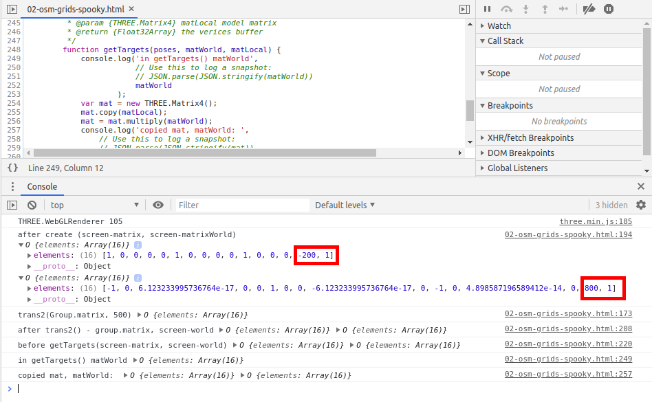
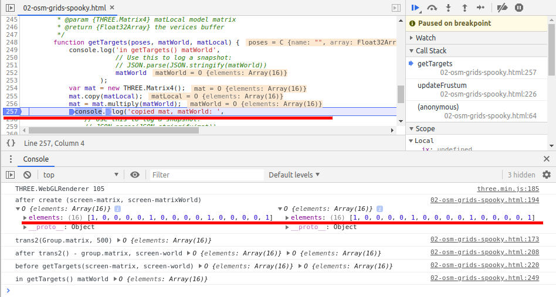

# Spooky browsers (Chrome, Firefox, ...)

## The spookiness
When debugging js program, there are some spooky problem:

1. If a break point is toggled on at 02-osm-grids-spooky.html line 257, the output of previous logs look like this:

2. If a break point is toggled off at 02-osm-grids-spooky.html line 257, the output of previous logs look like this:

The logging sequence is executed the in sychronized manner, one after an other.

The mysterious problem is, if you break at a later line, the previous logged information will be changed.
I am not using a quantum computer, but the browsers, both Chrome and Firefox showing quantum spookiness.

## Why?

This happens from 2 things entangled:

1. The browsers like Chrome usually show logged data when required. In other words, asynchronouslly.

See [a similar problem not so look like a physical problem at StackOverflow](https://stackoverflow.com/questions/23429203/weird-behavior-with-objects-console-log)

2. Three.js update object's matrix at each rendering by default.

So, when you click at the object to expanding the data,
it's showing data already updated by many rendering cycles. 

## Untangle it

# Key points for GPU calculation (memo)

1. The gl_Position range is [vec3(-1), vec3(1)]

This is the clip space renge

see 02-osm-grids-GPU-failed.html#References.

2. For "02-osm-grids.temp.htm", all "gl_Position = 0.5" won't makes fragment working

in GPUComputationRenderer:

    function getPassThroughVertexShader() {
        gl_Position = vec4( 0.5 );
        // This is working:
        // gl_Position = vec4( normalize(position) - 0.5, 1.0 );
    }

Output are all 0.

3. THREE.Camera must call updateProjectionMatrix()

4.
